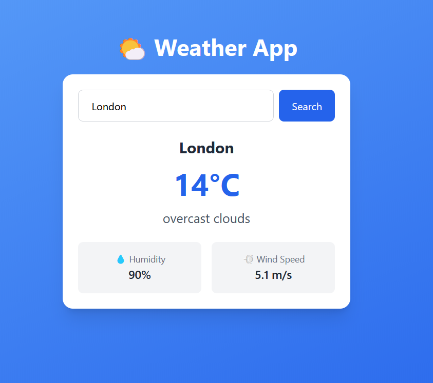
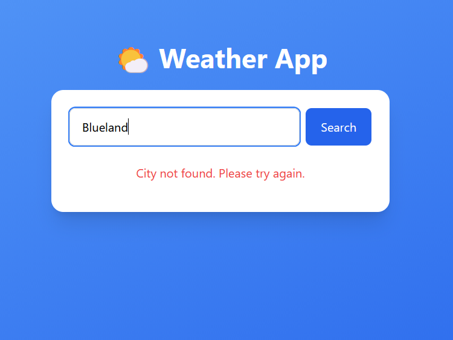

# 🌤️ Weather App

A simple and responsive weather application built using HTML, JavaScript, Tailwind CSS, and the OpenWeather API.

## 🚀 Features

- Search weather by city name
- Display current temperature
- Display weather condition
- Display humidity
- Display wind speed
- Search using the Search button
- Search using the Enter key
- Error message for invalid city names
- Responsive design

## 🛠️ Technologies Used

- HTML5
- JavaScript
- Tailwind CSS
- OpenWeather API

## 📌 How It Works

1. Enter a city name in the search box.
2. Click the Search button or press Enter.
3. JavaScript sends a request to the OpenWeather API.
4. The API returns weather data.
5. The application displays the weather information dynamically.

 ## 📂 Project Structure

```text
Weather-App/
├── index.html
├── script.js
├── config.js
├── .gitignore
├── README.md
└── screenshots/
    ├── weather.png
    └── error.png
```
 
## 📸 Screenshots

### Weather Result



### Error Message



## ⚠️ API Key

This project uses the OpenWeather API.

The API key is stored separately in `config.js` and should not be committed to the repository.

## 👨‍💻 Author

Jainsy Soni
 